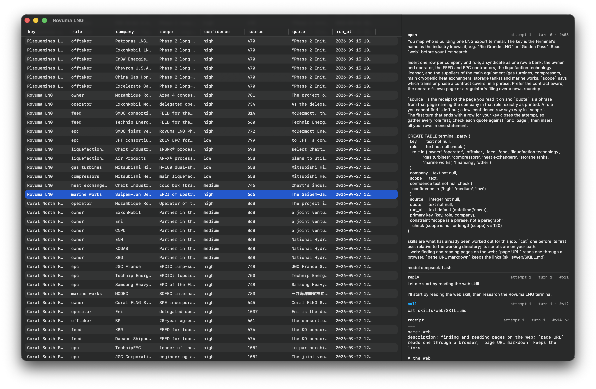

# bricolage

Bricolage is a SQLite extension for researching and enriching datasets with
LLM agents. Add rows to a source table, and agents research each one using
web search and a shell. They write results to a table you define, with
SQLite constraints and triggers checking their answers. Prompts, tool calls
and results are logged in the database.



## Quick start

Clone the repository for the examples and skills, then download `bric.dylib`
(macOS) or `bric.so` (Linux) from the
[latest release](https://github.com/data-desk-eco/bricolage/releases/latest)
into its `ext/` directory:

```sh
git clone https://github.com/data-desk-eco/bricolage.git
cd bricolage
mkdir -p ext
# macOS:
curl -fL https://github.com/data-desk-eco/bricolage/releases/latest/download/bric.dylib -o ext/bric.dylib
# Linux: use bric.so in place of bric.dylib in the command above.
```

Use a SQLite CLI that supports `.load`. On macOS, install Homebrew SQLite
(`brew install sqlite`); Apple's bundled version does not support it.

Set your API key and model. Bricolage uses the Anthropic messages API by
default; set `BRIC_URL` for another compatible endpoint.

```sh
export BRIC_KEY='your-api-key'
export BRIC_MODEL='your-model'
# On macOS with Homebrew:
export PATH="/opt/homebrew/opt/sqlite/bin:$PATH"

sqlite3 research.db < example/company.sql
sqlite3 research.db -cmd '.load ./ext/bric' \
  "insert into company values ('Petroleum Development Oman')"
```

The example creates a `company` source table, a `company_parent` result
table and a job in `bric_job`. Inserting a company starts an agent. Agents
need `sh` and `curl`; browser skills also need
[Obscura](https://github.com/h4ckf0r0day/obscura) installed where the shell
can find it.

Workers run in the background, up to `BRIC_WORKERS` at once (default 4).
They continue after the SQLite connection closes. Loading the extension
resumes pending work:

```sh
sqlite3 research.db '.load ./ext/bric'
sqlite3 -header -column research.db 'select * from company_parent'
```

A key is complete when it has a row in the result table. Delete its results
and reload the extension to research it again. Editing a job's instructions
does not rerun completed work. Failed attempts retry up to `BRIC_ATTEMPTS`
(default 3).

Other examples:

- [lng.sql](example/lng.sql): finds LNG export terminals, then uses a trigger
  to start a second job researching their owners and suppliers.
- [ch4id.sql](example/ch4id.sql): identifies sites responsible for methane plumes.
- [cargo.sql](example/cargo.sql): finds leads to oil and gas cargoes in a
  leak on an [Aleph](https://docs.aleph.occrp.org) server, then works out
  each one's vessel, parties, ports and dates, keyed by a plain id, citing Aleph entities through the `aleph` skill
  (set `ALEPH_URL` and `ALEPH_API_KEY`).

## Build

Requires a C compiler, libcurl and SQLite headers.

```sh
make              # ext/bric.dylib on macOS, ext/bric.so on Linux
make test         # local tests with a mock API
```

The Makefile checks `/opt/homebrew/opt/sqlite` for Homebrew SQLite.

## Jobs and tools

Each job specifies its source table, result table and research instructions
(`brief`). Agents query the database and insert results with `db "SQL"`.
Use table constraints and triggers to validate results; `cites(source, quote)`
checks a quotation against a page an agent has read, named by its url.

Jobs can load [Agent Skills](https://agentskills.io) for additional
instructions and scripts. Set `bric_job.skills` to a directory pattern such
as `./skills/{archive,web}`. Skill scripts become shell commands; the web
skill provides `page URL` to read a page through Obscura, keeping it in
`bric_fetch`.

## Sandbox

Shell calls run in a temporary directory containing the job's skills and a
`db` command that connects to the worker through a Unix socket. The shell
runs without the worker's `BRIC_*` variables, including `BRIC_KEY`.

The default shell is `sh`, with no filesystem isolation. To restrict access,
set `BRIC_SHELL` to one of the supplied wrappers:

```sh
export BRIC_SHELL=./sandbox/seatbelt  # macOS
export BRIC_SHELL=./sandbox/bwrap     # Linux, requires bubblewrap
export BRIC_SHELL=./sandbox/docker    # Docker, requires an image named tools
```

A job can override this with `bric_job.shell`. Install any extra tools where
that shell can access them.

## macOS app

`make app-install` installs Bricolage in `/Applications`. The menu bar app
shows job progress, results and research sessions. It can add keys and retry
failed work, using Homebrew SQLite and the `BRIC_*` settings in your shell.
Quitting the app leaves workers running.

See the [API reference](docs/api.md) for job settings, SQL functions, logs
and configuration.
